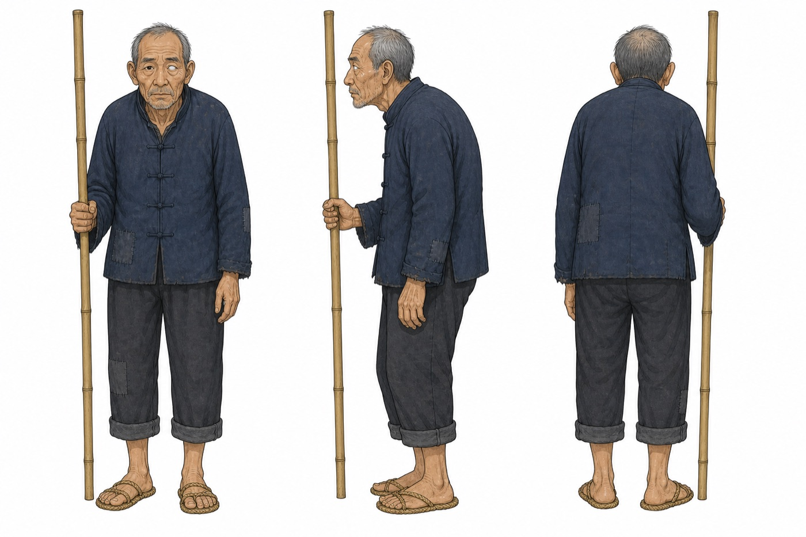

**繁體中文（台灣）** · [English](README.en.md)

# novel-characters

將小說或短篇故事轉換成可直接投入角色設計、配音與製作流程的角色設定集。

- **角色清單**：合併跨章節的正式名稱、稱謂與別名。
- **人物分析**：性別、年齡、身分、外貌、性情、動機、人物弧光與關係，並附逐字原文依據。
- **形象提示詞**：中英雙語角色設計、反向提示詞、風格標籤與三視圖規格。
- **音色提示詞**：音色、音高、語速、口音、情緒與中英雙語音色設計提示詞。
- **可攜式成果**：`cast.json`、Markdown 與可離線開啟的 `report.html`。
- **三視圖**：在 Codex 的 `$imagegen` 可用時，為主要角色生成正面、側面與背面設定圖。




## 使用方式

先依[儲存庫根目錄說明](../../README.md)完成安裝，再於 Codex 或 OpenCode 中輸入：

```text
$novel-characters 請分析 ./我的小說.txt，輸出到 ./角色設定
```

OpenCode 可完整執行角色分析、驗證與報告產生；若目前環境沒有圖像工具，技能會交付三視圖提示詞並明確標示未產圖。

## 處理流程

1. 依段落將長篇文字切成帶重疊區的分塊，避免角色剛好落在分界而遺漏。
2. 掃描每個分塊，擷取角色名稱、別名、觀察與逐字引文。
3. 依名稱與別名合併角色，並按出現分塊數估算戲份。
4. 為選定角色建立人物、形象與音色設定。
5. 執行確定性驗證，修正所有錯誤後才產生報告。
6. 在圖像工具可用時生成三視圖，最後輸出 Markdown 與離線 HTML。

每次執行需使用新的空白工作目錄；工具會拒絕混有前次產物的目錄，避免舊角色資料滲入新報告。

## 驗證規則

| 規則 | 目的 |
| --- | --- |
| `persona.evidence` 必須是原文中的連續逐字片段 | 防止虛構或拼接引文 |
| 影像提示詞不得出現角色名稱或別名 | 避免影像模型被既有名稱偏誤影響 |
| 分析欄位使用台灣繁體中文，模型提示詞依欄位使用英文 | 維持穩定、可重用的輸出格式 |
| `importance` 僅接受四種列舉值 | 保護資料結構相容性 |

逐字引文不做繁簡轉換，確保永遠能與來源文字比對。

## CLI

```bash
node scripts/novel-characters.mjs chunk book.txt workdir
node scripts/novel-characters.mjs merge workdir
node scripts/novel-characters.mjs validate cast.json book.txt
node scripts/novel-characters.mjs render cast.json --html
node scripts/novel-characters.mjs slug "胡二爺"
```

## 限制

- 單次最多 24 個分塊，約 33 萬字元；超出時會回報 `truncated: true`。
- 預設只為 `protagonist` 與 `major` 產生三視圖。
- 角色分開產圖時仍可能發生畫風漂移；可依 `references/turnaround.md` 使用首張成圖作為後續風格參考。
- 沒有圖像工具時不會產生 PNG，但 JSON、Markdown、HTML 與三視圖提示詞仍可正常交付。

## 自測

```bash
node scripts/selftest.mjs
```

自測涵蓋分塊、別名合併、資料驗證、台灣繁體中文檢查、Markdown 與 HTML 渲染；不呼叫模型，也不消耗模型額度。
